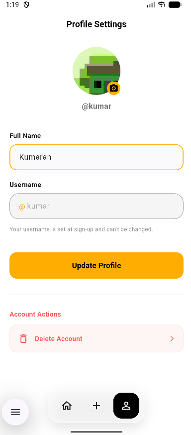

<p align="center">
  
</p>

<h1 align="center">FixIt Community</h1>

<p align="center">
  <b>A community-driven app for sharing tech problems and their fixing steps.</b><br/>
  <i>Built with Flutter &amp; Firebase</i>
</p>

<p align="center">
  
  
  
  
  
</p>

---

## 📱 Overview

**FixIt Community** is a mobile application that lets people come together to solve everyday technology problems. Users post the issues they run into — from a flickering laptop screen to a printer that won't connect — along with the step-by-step fixes that worked for them. Others can browse a searchable, category-filtered feed, open a problem for the full write-up, and build their own profile in the community.

Whether you are a hobbyist, a student, or an IT enthusiast, FixIt Community is your shared knowledge base for troubleshooting electronics, computers, mobile devices, networking gear, and more.

> 💡 **Demo mode** — The app ships with an offline demo mode (`lib/config/app_config.dart`) that seeds realistic data so the whole experience is runnable and testable without a network connection or a Firebase project. Flip the switch to go live against Cloud Firestore.

---

## ✨ Features

- **🚀 Animated splash screen** — Branded intro with a fade/scale animation that remembers returning users and routes them straight to the feed.
- **👤 Username sign-up / login** — Lightweight, password-less onboarding. Pick a unique `@username` and you're in; the session persists locally via `shared_preferences`.
- **🏠 Community feed** — A reverse-chronological list of problems posted by the community, each showing title, category, author, and timestamp.
- **🗂️ Category filtering** — Quick category chips (Electronics, Computer, Mobile, Home Repair, Laptop, Networking, Printer, Software, Gaming Console, Other) to narrow the feed.
- **🔎 Full-text search** — Instant, case-insensitive search across title, description, category, author, and fixing steps (multi-word queries use AND semantics).
- **➕ Post a problem** — Compose a problem with a title, category, detailed description, and any number of ordered **fixing steps**.
- **📖 Problem detail view** — Dedicated screen with the full description and a numbered list of fixing steps.
- **⚙️ Profile management** — Edit your display name, upload a profile picture from the gallery (stored as base64), and delete your account (which also removes the problems you authored).
- **🧭 Floating glassmorphic navbar** — A modern, blurred bottom navigation bar with Home / Post / Profile destinations.
- **🌗 Material 3 design** — Polished, consistent UI built on a custom light theme with the Poppins font and a warm amber/black palette.

---

## 🛠️ Technology Stack

| Layer | Technology |
| --- | --- |
| **Framework** | [Flutter](https://flutter.dev/) 3.x (Dart SDK `^3.12.2`) |
| **Language** | Dart 3 |
| **Backend / DB** | [Firebase Core](https://pub.dev/packages/firebase_core) + [Cloud Firestore](https://pub.dev/packages/cloud_firestore) |
| **Local storage** | [shared_preferences](https://pub.dev/packages/shared_preferences) (session persistence) |
| **Media** | [image_picker](https://pub.dev/packages/image_picker) (profile photos) |
| **Typography** | [google_fonts](https://pub.dev/packages/google_fonts) — Poppins |
| **Design system** | Material 3 (`useMaterial3: true`) |
| **Platform** | Android (with release signing config) |

---

## 🏗️ Architecture

The app follows a **clean, layered structure** that keeps the UI completely decoupled from the data backend.

```
        ┌─────────────────────────────────────────────┐
        │                Screens (UI)                  │
        │   Splash · Username · Home · Add · Profile   │
        └───────────────────┬─────────────────────────┘
                            │  (never talks to Firebase directly)
                            ▼
        ┌─────────────────────────────────────────────┐
        │            DataService (single entry         │
        │         point for all persistence)           │
        └───────────┬───────────────────────┬─────────┘
                    │                        │
                    ▼                        ▼
        ┌──────────────────────┐   ┌──────────────────────┐
        │  Cloud Firestore      │   │  In-memory demo store │
        │  (production)         │   │  (offline demo mode)  │
        └──────────────────────┘   └──────────────────────┘
```

**Key architectural decisions**

- **`DataService` as the only data gateway.** Every screen calls `DataService` instead of `FirebaseFirestore` directly. All methods return plain `Map<String, dynamic>` / `List` data — never Firestore document types — so the UI stays backend-agnostic and unit-testable.
- **Demo mode toggle.** `lib/config/app_config.dart` exposes `demoModeEnabled`. When `true`, `DataService` serves seeded in-memory data; when `false` (or via `--dart-define=DEMO=false`), it performs real Cloud Firestore operations. The UI behaves identically in both modes.
- **Session persistence.** The signed-in `@username` is stored in `shared_preferences`; the splash screen reads it to decide whether to route to the feed or the username screen.
- **Feature-first folder layout.** Code is organized by responsibility (`config`, `core/theme`, `data`, `services`, `utils`, `widgets`, `screens`) rather than by file type only.

---

## 📂 Project Structure

```
fixit_community/
├── android/                     # Native Android project & signing config
├── assets/
│   └── images/
│       └── app_icon.png         # App logo / launcher icon
├── lib/
│   ├── config/
│   │   └── app_config.dart      # Global demo-mode switch
│   ├── core/
│   │   └── theme/
│   │       ├── app_colors.dart  # Central color palette
│   │       └── app_theme.dart   # Material 3 light theme (Poppins)
│   ├── data/
│   │   └── demo_data.dart       # Offline seed data (categories, problems, user)
│   ├── services/
│   │   └── data_service.dart    # Single persistence entry point
│   ├── utils/
│   │   └── problem_filter.dart  # Pure, testable search-match logic
│   ├── widgets/                 # Reusable UI (navbar, cards, chips, header…)
│   ├── screens/
│   │   ├── authentication/      # Splash & Username screens
│   │   ├── home/                # Feed & Problem detail
│   │   ├── post/                # Add Problem
│   │   └── account/             # Profile
│   ├── firebase_options.dart    # Generated Firebase config
│   └── main.dart                # App entry point
├── screenshots/                 # App screenshots
├── test/                        # Widget & unit tests
├── pubspec.yaml
└── README.md
```

---

## 🖼️ Screenshots

<p align="center">
  
  
  
  
</p>
<p align="center">
  
</p>

---

## ⚙️ Installation

### Prerequisites

- [Flutter SDK](https://docs.flutter.dev/get-started/install) 3.x
- Dart SDK `^3.12.2`
- An Android device / emulator (or iOS toolchain for iPhone builds)
- A Firebase project (only required for live/production mode)

### Steps

1. **Clone the repository**

   ```bash
   git clone <your-repository-url>
   cd fixit_community
   ```

2. **Install dependencies**

   ```bash
   flutter pub get
   ```

3. **(Optional) Configure Firebase**

   The app is pre-wired to the Firebase project `fixit-community-6ec36` via `lib/firebase_options.dart`. To use your own backend:

   - Create a Firebase project and add an Android app with package `com.devthanseem.fixitcommunity`.
   - Download `google-services.json` into `android/app/`.
   - Regenerate config with the FlutterFire CLI or replace `lib/firebase_options.dart`.

4. **(Optional) Disable demo mode**

   Open `lib/config/app_config.dart` and set:

   ```dart
   bool demoModeEnabled = false;
   ```

   Or at build time: `flutter run --dart-define=DEMO=false`.

5. **Run the app**

   ```bash
   flutter run
   ```

> 📝 In demo mode (`demoModeEnabled = true`, the default) the app runs fully offline with seeded data — no Firebase setup required.

---

## 📦 Download / Build APK

The `build/` directory is git-ignored, so no prebuilt binary is committed to the repository. Generate a release APK locally:

```bash
flutter build apk --release
```

The signed release artifact will be created at:

```
build/app/outputs/apk/release/app-release.apk
```

### Release signing

Release builds use an upload key configured in a local, git-ignored `android/key.properties` (already present). If that file is absent, the build gracefully falls back to debug keys. To set up your own signing:

1. Generate an upload keystore and place `key.properties` + the `.jks` under `android/`.
2. Re-run `flutter build apk --release`.

You can also produce an Android App Bundle for Play Store distribution:

```bash
flutter build appbundle --release
# → build/app/outputs/bundle/release/app-release.aab
```

---

## 🚀 Future Improvements

- 🔐 **Account authentication** — Replace password-less usernames with email/password or OAuth (Google, Apple) sign-in.
- 💬 **Comments & reactions** — Let the community discuss fixes and upvote helpful solutions.
- 🔔 **Push notifications** — Alert users when someone replies to or solves their problem.
- 🌐 **Social features** — Follow other members and curate a personalized feed.
- 🖼️ **Rich media in problems** — Attach photos/screenshots to problems and steps (currently profile images only).
- 🔄 **Real-time updates** — Switch the feed to Firestore listeners for live refresh instead of one-shot loads.
- 🌙 **Dark mode** — Add a dark theme alongside the current light theme.
- 🌍 **Localization** — Internationalize strings for a wider audience.
- 🧪 **Expanded test coverage** — Grow the widget/unit tests (search, data service, profile flows).
- 📱 **iOS & web support** — Broaden platform targets beyond Android.

---

## 📄 License

This project is licensed under the **MIT License**.

```
MIT License

Copyright (c) 2026 FixIt Community

Permission is hereby granted, free of charge, to any person obtaining a copy
of this software and associated documentation files (the "Software"), to deal
in the Software without restriction, including without limitation the rights
to use, copy, modify, merge, publish, distribute, sublicense, and/or sell
copies of the Software, and to permit persons to whom the Software is
furnished to do so, subject to the following conditions:

The above copyright notice and this permission notice shall be included in all
copies or substantial portions of the Software.

THE SOFTWARE IS PROVIDED "AS IS", WITHOUT WARRANTY OF ANY KIND, EXPRESS OR
IMPLIED, INCLUDING BUT NOT LIMITED TO THE WARRANTIES OF MERCHANTABILITY,
FITNESS FOR A PARTICULAR PURPOSE AND NONINFRINGEMENT. IN NO EVENT SHALL THE
AUTHORS OR COPYRIGHT HOLDERS BE LIABLE FOR ANY CLAIM, DAMAGES OR OTHER
LIABILITY, WHETHER IN AN ACTION OF CONTRACT, TORT OR OTHERWISE, ARISING FROM,
OUT OF OR IN CONNECTION WITH THE SOFTWARE OR THE USE OR OTHER DEALINGS IN THE
SOFTWARE.
```

---

## 👨‍💻 Developer

**FixIt Community** is designed and developed by **devthanseemx**.

- 📦 Package ID: `com.devthanseem.fixitcommunity`
- 🔥 Firebase project: `fixit-community-6ec36`
- 💡 Feedback, bug reports, and contributions are welcome!

---

<p align="center">
  Made with ❤️ and Flutter · 🔧 FixIt Community
</p>
